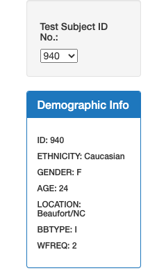

# Chrissy Cho's Plotly_Bacteria
### Table of Contents
[ 1. Project Overview ](#desc)  
[ 2. Resources ](#resc)  
[ 3. Objectives ](#obj)  
[ 4. Challenge Overview ](#chal)  
[ 5. Challenge Objective ](#chalsum)  
[ 6. Final Outlook ](#find) 

## Project Overview
In this module, we've learned building different types of interactive charts through fetching json data using plotly and d3 libraries. We used D3 event handlers to add interactive features to a data visualization. 

## Resources
- Data Source: [sample.json](https://github.com/chrissycho/Plotly_Bacteria/blob/master/challenge/samples.json)
- Software: Bootstrap, D3, html, JavaScript, Plotly

## Objectives
- Create basic plots with Plotly
- Use D3 to fetch external JSON file 
- Pasre data in JSON format using JavaScript
- Use JavaScript functions (sort, map, slice, etc) to manipulate data
- Add interactivity into the plots such as event handlers 

## Challenge Overview
In this challenge, we've completed visualizing the bacteria data for each volunteer such as their demographic, top 10 bacterial species in their belly buttons, and frequency of washing their belly button. Whever someone maneuvers over the volunteer ids on the panel, information relevant to that person will appear in 4 different charts. 

## Challenge Objective
- Create a bar chart of the top ten bacterial species in a volunteer’s navel. Use JavaScript to select only the most populous species.
- Create a bubble chart to visualize the relative frequency of all the bacterial species found in a volunteer’s navel.
- Complete the demographic information panel, if you have not done so. 

## Final Outlook

This is what it looks like when we select an ID.

This shows the top 10 bacterial species in the selected volunteer's belly.

The size of the bubble indicates how many of a particular bacteria species (for each OTU ID) lives in the belly button. 

This gauge chart shows how many times the selected volunteer wash their belly button so we can have an idea whether the frequency of washing can lead to more bacteria. 